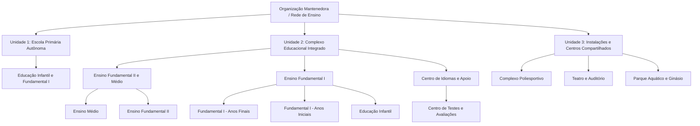

# ERPZ Educacional (Ifitwala Ed)

## Um Sistema Operacional Unificado para a Educação

O **ERPZ Educacional (Ifitwala Ed)** é um Sistema Operacional Educacional (EOS) de código aberto projetado para escolas, colégios, faculdades e grandes redes de ensino.

Ele substitui pilhas fragmentadas de softwares escolares por uma espinha dorsal operacional coesa: **uma única fonte da verdade institucional**, um único modelo de permissões, uma malha de fluxos de trabalho integrada e uma superfície unificada de dados e análises para as pessoas que vivenciam o cotidiano escolar.

O sistema é um ERP Educacional em seu sentido mais profundo: uma plataforma de recursos educacionais. Instituições de ensino não são empresas genéricas. São organizações humanas, relacionais, regidas por calendários rigorosos, onde o aprendizado, o cuidado com os alunos, o cumprimento de normas, o planejamento de aulas, a comunicação com as famílias e a confiança institucional convivem diariamente. O ERPZ Educacional foi construído exatamente em torno dessa realidade.

---

## 🔄 A Transformação Operacional

Muitas escolas e redes de ensino operam sobre uma pilha frágil de ferramentas desconectadas:
- Um sistema isolado para captação e admissões;
- Outro para secretaria e matrículas;
- Outro para montagem de grades e horários;
- Outro para diário de classe e plano de ensino;
- Outro para controle de frequência e bilhetagem;
- Outro para RH e folha de pagamento;
- Outro para contabilidade e mensalidades;
- Outro para comunicação com os pais (aplicativos terceiros);
- E dezenas de planilhas paralelas para tentar reconciliar o que os softwares não conseguem compartilhar.

O resultado é a duplicação crônica de dados, divergência de permissões de acesso, relatórios manuais lentos, indefinição de responsabilidades e equipes sobrecarregadas movendo informações de um lado para o outro em vez de focar no aprendizado dos alunos.

O ERPZ Educacional adota uma abordagem totalmente integrada. Ele não trata a escola como uma colcha de retalhos de módulos independentes, mas como um **sistema operacional institucional vivo**, onde os fluxos acadêmicos, operacionais, pedagógicos, de admissão, recursos humanos, arquivos, site institucional e financeiros bebem da mesma fonte de dados governada.

> **Princípio Central:** Cada portal, processo, diário, relatório e decisão administrativa aponta sempre para a mesma e única fonte da verdade institucional.

---

## 🌟 Por Que Instituições Adotam o ERPZ Educacional

1. **Fonte Única da Verdade Institucional:**
   Admissões, matrículas, alunos, responsáveis legais, professores, grades horárias, arquivos e operações financeiras trabalham a partir do mesmo registro oficial governado.
2. **Quatro Portais Integrados, Uma Só Realidade:**
   Professores/Gestores, Alunos, Responsáveis e Famílias Candidatas possuem experiências de uso sob medida, enquanto os dados subjacentes permanecem estritamente unificados.
3. **Hierarquia Organizacional Nativa em Árvore:**
   Redes de ensino, unidades, escolas, departamentos, programas, turmas e salas são modelados como árvores genealógicas com herança automática de permissões e relatórios consolidados.
4. **Segurança e Permissões no Core do Sistema:**
   O controle de visibilidade é aplicado no servidor (backend) considerando papel do usuário, parentesco, escola de lotação e etapa do processo.
5. **Funil de Admissões Conectado Diretamente à Matrícula:**
   Da primeira consulta de interesse (*Inquiry*), envio de documentos e entrevistas até a recomendação e conversão em matrícula oficial em um fluxo ininterrupto.
6. **Separação Clara entre Currículo, Ministração e Avaliação:**
   O que a instituição planeja pedagogicamente, como os professores conduzem as aulas e como as evidências de aprendizagem são mensuradas conectam-se de forma clara e flexível.
7. **Planejamento Temporal e Frequência Baseados na Realidade Operacional:**
   Calendários escolares, ofertas de disciplinas, reservas de salas, agendamentos de professores e chamada de presença utilizam registros operacionais reais e em tempo real.
8. **Governança Segura de Documentos e Mídias:**
   Arquivos, prontuários, laudos e fotos são protegidos por permissões contextuais de armazenamento seguro (via Ifitwala Drive).
9. **Dimensionado para Picos de Demanda Escolar:**
   Períodos de rematrícula, fechamento de notas, início de ano letivo e chamadas simultâneas são tratados como operação normal de alto desempenho.
10. **Crescimento Escalável sem Ruptura de Modelo:**
    A mesma estrutura atende com excelência desde uma escola individual até uma rede internacional multicâmpus com compartilhamento inteligente de instalações.

---

## 🌳 A Estrutura Hierárquica em Árvore

A educação é hierárquica por natureza. O ERPZ Educacional reflete isso estruturalmente. A hierarquia não é apenas uma taxonomia de rótulos; é o motor de lógica para herança de regras, consolidação analítica e isolamento de permissões:

### Benefícios da Hierarquia Nativa
* **Permissões Granulares:** Diretores têm visão da sua escola; coordenadores de segmento visualizam suas turmas; a diretoria da mantenedora enxerga relatórios consolidados de toda a rede.
* **Herança de Políticas:** Calendários letivos, critérios de aprovação e termos de uso podem ser definidos no topo e herdados pelas unidades sem digitação redundante.
* **Recursos Compartilhados:** Espaços físicos (quadras, laboratórios, auditórios) podem ser reservados por diferentes escolas da rede com prevenção automática de conflitos de horário.

---

## 📱 Uma Só Fonte da Verdade, Quatro Portais Especializados

Um diretor, professor, orientador educacional, enfermeiro, pai ou estudante não devem vivenciar a plataforma da mesma forma:

| Portal | Público Principal | Foco de Atuação |
| :--- | :--- | :--- |
| **Portal do Colaborador (Staff Hub)** | Professores, coordenadores, pedagogos, secretários e direção | Diário de classe, chamadas, lançamento de avaliações, planos de aula, tarefas, pareceres, ocorrências e relatórios. |
| **Portal do Aluno (Student Hub)** | Estudantes | Horário de aulas, materiais didáticos, tarefas entregues e pendentes, boletim, portfólio de evidências e comunicados. |
| **Portal da Família (Guardian Hub)** | Pais e responsáveis legais | Acompanhamento pedagógico, frequência diária, boletins, autorizações digitais, calendário de eventos e comunicação com a escola. |
| **Portal de Admissões (Admissions Portal)** | Famílias candidatas e novos inscritos | Ficha de inscrição online, envio de laudos e histórico escolar, agendamento de visitas/entrevistas e aceite de matrícula. |

---

## 📚 Modelo Pedagógico: Currículo, Ministração e Avaliação

O ERPZ Educacional divide a jornada pedagógica em três dimensões complementares:

1. **Currículo (O que a escola planeja):**
   - Estruturação de programas pedagógicos, matrizes curriculares, disciplinas, competências (BNCC / internacionais), unidades de aprendizagem e materiais de apoio reutilizáveis ano a ano.
2. **Ministração (O que o professor conduz na sala de aula):**
   - Planos de aula integrados ao calendário, planos de unidade (*Unit Plans*), controle de sessões, diário de bordo e acompanhamento de ritmo de conteúdo.
3. **Avaliação (Como a aprendizagem é evidenciada e registrada):**
   - Tarefas, rubricas de critérios, observações formativas, notas quantitativas e qualitativas, portfólio do aluno e boletins de período com médias e frequência automáticas.

---

## 🛠 Módulos e Ferramentas Disponíveis

* **Admissões e Secretaria:** Inscrições online (*Inquiry*), formulário dinâmico, triagem de candidatos, agendamento de entrevistas, controle de documentos pendentes e conversão direta em matrícula.
* **Gestão Acadêmica:** Matrículas por ano/período, enturmação de alunos, alocação de docentes, emissão de boletins, atas e históricos escolares.
* **Grade e Horários (Scheduling):** Montagem de grades horárias semanais, alocação de salas e professores, e controle de choque de horários.
* **Frequência e Chamada:** Registro rápido de presença em sala de aula pelo celular ou computador, justificativas médicas e alertas automáticos aos pais em caso de ausência.
* **Saúde Escolar (Health):** Ficha médica, alergias, restrições alimentares, controle de vacinas, registro de atendimentos na enfermaria e administração segura de medicamentos autorizados.
* **Orientação Educacional (Counseling):** Prontuário confidencial de acompanhamento comportamental, planos de atendimento especializado e notas de orientação psicopedagógica.
* **Atividades Extracurriculares (ECA):** Inscrições em oficinas esportivas, culturais, clubes escolares e controle de turmas no contraturno.
* **RH Escolar e Formação Docente:** Gestão de professores, controle de faltas e licenças, e acompanhamento de orçamento e horas de capacitação pedagógica (*Professional Development*).
* **Governança e Políticas:** Publicação de regulamentos internos, código de conduta e termos de uso com coleta e auditoria de assinaturas digitais de responsáveis e colaboradores.

---

## 🔒 Segurança, Privacidade e Proteção de Dados

Escolas lidam com os dados mais sensíveis de uma família: crianças e adolescentes. O ERPZ Educacional foi construído sob o princípio de **Privacy by Design**:
* **Isolamento Estrutural:** Uma escola filha não enxerga dados de outra unidade irmã sem regra explícita de compartilhamento.
* **Sigilo Médico e Psicológico:** Prontuários de saúde e anotações da orientação educacional possuem controle de acesso independente e restrito aos profissionais competentes.
* **Governança de Imagens e Documentos:** Fotos e laudos médicos não ficam em links públicos abertos; o acesso é intermediado pelo motor de permissões do sistema.
* **Trilhas Completas de Auditoria:** Cada nota lançada, chamada alterada ou documento consultado registra data, hora e responsável.

---

> **Instalação e Implantação:** Para detalhes de requisitos de ambiente, dependências e comandos de instalação no Frappe Bench, consulte o arquivo [LEIAME.md](LEIAME.md).

---

## 🌐 Localização em Português do Brasil (pt-BR)

O projeto conta com tradução integral para o **Português do Brasil (pt-BR)** implementada através dos arquivos padronizados `ifitwala_ed/translations/pt-BR.csv` e sincronização no banco de dados.

* **Integridade do Código Preservada:** Todas as entidades internas, variáveis, modelos no banco de dados e APIs permanecem em padrão técnico internacional sem alteração de nomes de colunas ou lógica de execução, traduzindo estritamente a camada de visualização em tela.

---

## 📄 Licença

Distribuído sob a licença **MIT License**. Consulte o arquivo `license.txt` para mais detalhes.
