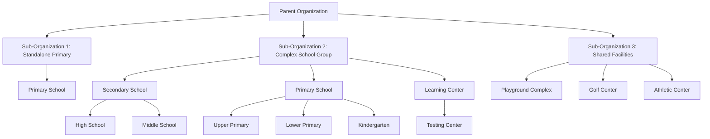

# Ifitwala Ed

## A Unified Education Operational System

Ifitwala Ed is an open-source Education Operational System for schools, colleges, and education groups.

It replaces fragmented school software with one coherent operational backbone: one institutional source of truth, one permission model, one workflow fabric, and one analytics surface for the people who run and experience school life every day.

Ifitwala Ed is an Education ERP in the deeper sense: an Education Resource Platform. Schools are not generic enterprises. They are human, time-bound, relationship-heavy institutions where learning, care, compliance, scheduling, communication, finance, and trust all meet. Ifitwala_Ed is built around that reality.

## The Shift

Many educational institutions operate on a fragile stack of disconnected tools: one system for admissions, another for enrollment, another for timetable, another for learning, another for HR, another for accounting, another for communications, and spreadsheets everywhere to reconcile what the systems cannot share.

The result is often duplicated data, permission drift, manual reporting, unclear ownership, and staff spending too much time moving information instead of acting on it.

Ifitwala Ed approaches the problem differently. It does not treat the school as a collection of unrelated modules. It treats the institution as one connected operational system where academic, operational, admissions, HR, communication, file, website, and financial workflows reference the same governed reality.

That is the heart of the product: every portal, workflow, report, and decision should point back to the same source of truth.

## Why Schools Adopt Ifitwala Ed

1. **One institutional source of truth**
   Admissions, enrollment, students, guardians, staff, programs, schedules, communications, files, and financial operations work from the same governed institutional record instead of disconnected SaaS tools and spreadsheets.

2. **Four portals, one reality**
   Staff, students, guardians, and admissions families each get a focused experience, while the underlying records remain unified.

3. **Hierarchy is native**
   Organizations, schools, programs, teams, and locations are modeled as trees. Parent nodes can govern or report across descendants where the feature contract allows it, while sibling branches remain isolated.

4. **Permissions are part of the operating model**
   Visibility is enforced server-side through role, relationship, school, organization, and workflow context. The UI improves usability, but the backend owns correctness.

5. **Admissions can connect to enrollment**
   Inquiry, applicant lifecycle, evidence, review, recommendations, admissions portals, and applicant-to-enrollment flows can live in one institutional context.

6. **Curriculum, delivery, and assessment stay distinct**
   What the school plans, what teachers deliver, and how learning is measured are connected but not confused.

7. **Scheduling and attendance use operational truth**
   School calendars, program offerings, student groups, room bookings, employee bookings, and attendance are governed through explicit operational records (no assumptions made).

8. **Files and private media are governed**
   Ifitwala Drive acts as the governed file authority, while Ifitwala Ed keeps files attached to the educational workflow, tenant context, and user-facing surface where they belong.

9. **The platform is designed for peak school load**
   Admissions windows, attendance periods, reporting deadlines, and parent-facing traffic are treated as normal operating conditions, not edge cases.

10. **Schools can grow without changing the model**
    The same hierarchy can support a single school, a multi-campus group, shared facilities, or a broader education network.

## The Nested Hierarchy

Education is hierarchical by nature. Ifitwala_Ed reflects this at its core.

The nested hierarchy is not just a labeling system. It is the logic engine for permissions, reporting, policy inheritance, shared resources, academic structure, and operational roll-up. Everything important in the product is shaped by this model.

### Why The Hierarchy Matters

1. **Hierarchical permissions**
   A parent scope can include its descendants where the workflow contract says it should. A principal can work inside a school branch; group leadership can see across a broader branch; sibling schools remain isolated.

2. **Policy and configuration inheritance**
   Rules, calendars, academic setup, assessment structures, and operational settings can resolve from the nearest relevant ancestor instead of being duplicated manually across every child node.

3. **Multi-campus and multi-school governance**
   A school group can model legal entities, academic schools, departments, learning centers, and shared facilities without flattening them into one confusing list.

4. **Shared resources without permission leakage**
   Locations and facilities can be shared intentionally across descendant schools while preserving tenant isolation by default.

5. **Delegated authority**
   Teams, departments, employees, and reporting lines can mirror the way decisions, approvals, meetings, and responsibilities actually move through an institution.

6. **Roll-up analytics**
   Attendance, enrollment, utilization, student support, admissions, and operational reports can aggregate naturally from child nodes to parent nodes without manual spreadsheet consolidation.

## One Time Surface

In many school systems, academic timetables, room bookings, staff meetings, leave, events, exams, and facility use live in separate universes. That creates double-bookings, hidden conflicts, and weak utilization data.

Ifitwala Ed treats time as one operational reality. Teaching, meetings, events, room usage, and staff availability should be visible through shared calendars, explicit bookings, and scoped views that respect role and tenant permissions.

## Academic Model

Ifitwala_Ed separates curriculum, delivery, and assessment.

Curriculum is what the institution plans. Delivery is what teachers run with students. Assessment is how learning evidence is captured, interpreted, and reported.

This separation keeps the model flexible:

- programs, courses, learning units, lessons, and materials can be reused across years
- class delivery can adapt to real teaching contexts
- tasks, submissions, feedback, rubrics, observations, and reports can connect without collapsing into one rigid grading model
- attendance can be tied to actual teaching and calendar events instead of living as a detached register

## One Source Of Truth, Four Portals

A registrar, teacher, nurse, admissions officer, parent, student, and school leader should not experience the platform the same way.

Ifitwala_Ed keeps the institutional record unified while shaping the experience around four primary portals:

| Portal | Primary users | Focus |
| --- | --- | --- |
| Staff Portal | Teachers, academic staff, admissions staff, nurses, operational teams, leadership | Daily work, student context, attendance, tasks, admissions follow-up, communication, policies, and analytics |
| Student Portal | Students | Learning, tasks, feedback, calendars, portfolio, reports, and school context |
| Guardian Portal | Parents and guardians | Family-facing updates, consent, calendars, reports, communications, documents, and student progress |
| Admissions Portal | Prospective families and applicants | Inquiry, application progress, evidence submission, recommendations, visits, decisions, and transition into enrollment |

The portals are different on purpose. A guardian should not see the same operational controls as a registrar. A student should not experience the system as a back-office database. A teacher should not have to hunt through administrative screens to take the next classroom action.

But underneath those distinct experiences, the source of truth remains shared. A student record, guardian relationship, enrollment state, applicant file, policy acknowledgement, attendance event, or communication history should not become four separate versions of itself just because four different users need to interact with it.

## Communication And Operations

Ifitwala_Ed is designed to reduce institutional noise.

Communication should be targeted, contextual, and traceable. A message to Grade 10 guardians, an admissions follow-up, a policy acknowledgement, or a staff briefing should belong to the right audience and the right workflow rather than becoming another disconnected email thread.

Operations should work the same way. Health, safeguarding, student support, HR, professional development, expense reimbursement, inventory, facilities, websites, and finance all need their own controls, but they should still connect to the same institutional structure.

## Security, Privacy, And Trust

Schools hold sensitive human records. Ifitwala Ed treats security, privacy, and tenant isolation as product requirements from the start.

The data-governance approach is based on a few core principles:

1. **The institution owns one governed record**
   Student, guardian, staff, applicant, academic, attendance, communication, and financial data should not be duplicated across disconnected systems. The platform is designed so each workflow contributes to the same institutional truth.

2. **Access follows role, relationship, and scope**
   A user does not receive broad access simply because they can log in. Visibility depends on who they are, which school or organization branch they belong to, what relationship they have to the record, and what the workflow allows.

3. **Tenant isolation is structural**
   School branches, organizations, and descendants are part of the permission model. Parent-level visibility can roll down where appropriate, but sibling schools remain isolated unless an explicit governed sharing rule exists.

4. **Sensitive information is purpose-bound**
   Health, safeguarding, admissions evidence, contact information, private files, and family records require stricter handling than ordinary operational data. The system separates context from exposure: staff can receive the operational signal they need without automatically seeing every sensitive detail.

5. **Private media is governed**
   Files, previews, thumbnails, and downloads are not treated as raw storage links. They are resolved through governed access paths so the platform can respect privacy, surface context, and user permissions.

6. **Workflows leave an accountable trail**
   Admissions decisions, attendance changes, policy acknowledgements, communication, file access, financial actions, and student support activity should be traceable to the people and processes involved.

7. **Reports respect permission boundaries**
   Analytics should help leaders see patterns without leaking data across schools, roles, or relationships. Aggregation does not remove the need for scope discipline.

## Contact

For product or implementation discussions, contact [francois@ifitwala.com](mailto:francois@ifitwala.com).
